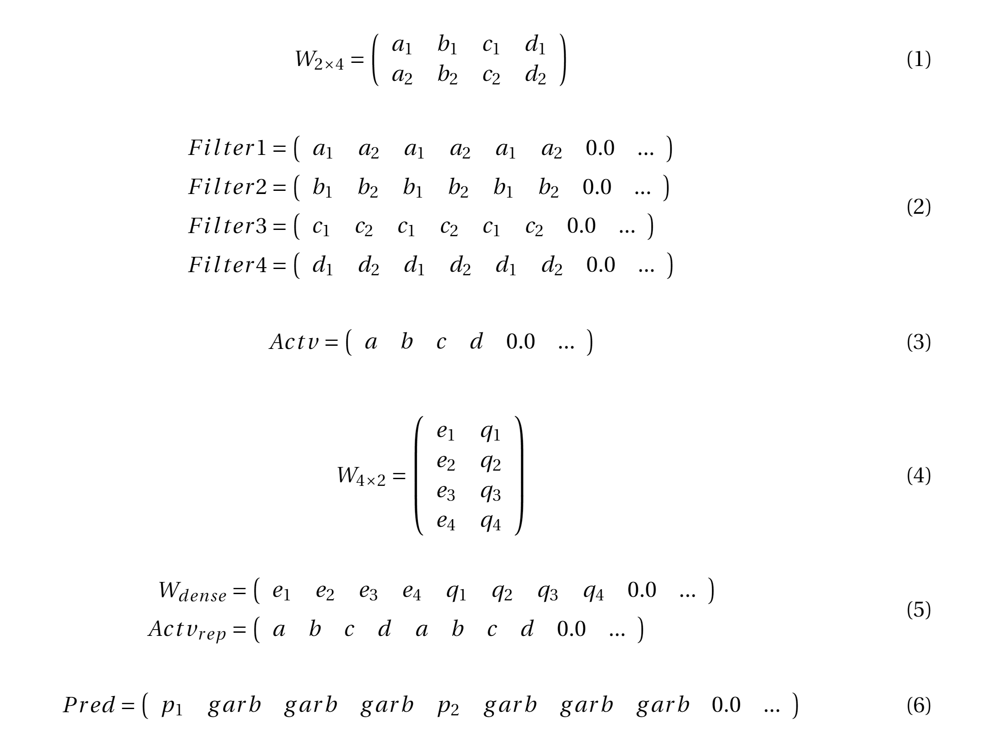

# Implementation of Poseidon[1] with CellCnn for benchmarking
## Introduction

This folder is for Semester Project in Computer Science II (12 credits) of Shufan Wang at [Laboratory of Data Security (LDS)](https://lds.epfl.ch/), EPFL 2021 to generate several benchmarks for comparison of optimized protocols with POSEIDON [1].

## Current Settings

Currently we use a set of crypto params below:
```
params := ckks.ParametersLiteral{
		LogN:     15,
		LogSlots: 14,
		LogQ:     []int{60, 60, 60, 52, 52, 52, 52, 52, 52, 52}, // 544
		LogP:     []int{61, 61, 61},                             // 183
		Scale:    1 << 52,
		Sigma:    rlwe.DefaultSigma,
	}
```
The initial (or max) level of ciphertext is 9. We use one local bootstrapping in each participants during the forward and backward pass. And the aggregate gradients with momentum is at level 2. Then the aggregate server will use one bootstrapping to recover the gradients to level 9 for weights update.

## Project Structure

- `cellcnnPoseidon/layers`: define the ciphertext circuit of Conv1D layer and Linear layer.

- `cellcnnPoseidon/centralized`: define the Cell CNN struct with initialization, forward, and backward.

- `cellcnnPoseidon/decentralized`: define a privacy-preserving federate learning protocol where each participant holds local data and together train a global Cell CNN by gradients aggregation.

- Some code in `cellcnnPoseidon/decentralized` and `utils/crypto`... is copied from spindle with some minor changes.

## How to Use

To init a local Cell CNN:
```
model := NewCellCNN(cnnSettings, cryptoParams, momentum, lr)
cw, dw := model.InitWeights(nil, nil, nil, nil) // random init weights, output the cleartext weights in matrix for plainnet
model.InitEvaluator(cryptoParams, maxM1N2Ratio) // init rotation keys, diagM...
model.sk = sk // for dummy bootstrapping
```

For batch forward and backward, please refer to `cellcnnPoseidon/benchmark_test.go`

## Quick Test
- To test the centralized forward and backward with a plaintext net, enter `centralized/` and run `$ go test -run TestWithPlainNetBwBatch`. It will init an encrypted net and a plaintext net, and compare the forward prediction and backward gradients.

- To test the decentralized protocol, enter `decentralized/` and run `$ go test -run TestDemo`. It will init a test according to the parameters in `decentralized/settings.go`.

## Settings for following examples

- number of cells = 3

- numbder of filters = 4

- number of makers = 2

- number of classes = 2

## Conv1d Layer

The weights of the layer is ciphertext at level 9 (initial level).
If the plaintext weight matrix has 4 filters each with 2 makers like Eq.(1).

The ciphertext weights slots will be pre-replicated for Ncells. It will be like Eq.(2).

**Conv1d Forward** Return the filter response average pooled over current batch cells. Following the settings above, the forward ciphertext output are at the left most slots like Eq.(3)

**Conv1d Backward** Return the gradients scaled with learning rate, without computing with momentum.


## Dense Layer

The weights of the layer is ciphertext at level 9 (initial level).
The plaintext dense layer weight matrix is like Eq.(4):

As shown in Eq.(5), the column packed ciphertext dense weights slots will multipliy with pooled activations, which are replicated by 2 times.

**Dense Forward** output the prediction for each class, which will be at the indices at [0, 1*nfilters] as Eq.(6):

**Dense Backward** relates to one collective bootstrapping, which is replaced by a decrypt-re-encrypt function.




## Ciphertext Level Tracing

Local computation with the crypto-parmeters above:
- Inital weights: 9
- Conv1d foward (activation): 7
- Dense forward (prediction): 4
- Dense backward: gradient (one bootstrapping used): 6, output err: 7
- Conv1d bacward: gradient: 4


  [1] S. Sav, A. Pyrgelis, J. R. Troncoso-Pastoriza, D. Froelicher, J.-P. Bossuat, J. S. Sousa, and J.-P. Hubaux, “POSEIDON: Privacy-Preserving Federated Neural Network Learning,” in NDSS, 2021
